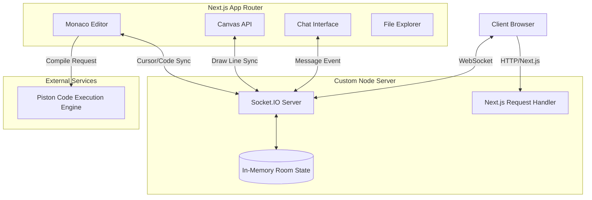

<div align="center">

# 🚀 DevSync

**An Engineer-First Real-time Collaborative Code Editor & Development Environment**

[](https://devsync-production-00b7.up.railway.app)
[](https://github.com/iam-sarthakdev/DevSync)
[](https://nextjs.org/)
[](https://socket.io/)
[](https://www.typescriptlang.org/)

*High-performance web IDE with bi-directional real-time syncing, integrated execution engine, and built-in team communication.*

</div>

---

## 📌 Table of Contents
- [System Architecture](#-system-architecture)
- [End-to-End User & Data Flow](#-end-to-end-user--data-flow)
- [Core Engineering Features](#-core-engineering-features)
- [Deep Dive: Project Structure](#-deep-dive-project-structure)
- [Local Setup & Deployment](#-local-setup--deployment)
- [Visual Gallery](#-visual-gallery)

---

## 🏗️ System Architecture

DevSync is built on a **Custom Next.js Server** architecture to natively support WebSockets alongside Next.js App Router for server-rendered UI. 



### Architectural Decisions

1. **Custom HTTP Server (`server.ts`)**: Instead of relying on standard serverless API routes (which cannot maintain stateful WebSocket connections), DevSync employs a custom HTTP server wrapping both `next/server` and `socket.io`.
2. **In-Memory State Management**: For optimal real-time performance without database bottlenecks, session states (files, user lists, active cursors) are managed via an in-memory `Map` data structure on the Node server.
3. **Piston API Integration**: Offloads the heavy lifting of secure, sandboxed code compilation/execution to the [Piston](https://github.com/engineer-man/piston) execution engine, preventing remote code execution (RCE) vulnerabilities on the primary server.

---

## 🔄 End-to-End User & Data Flow

### 1. Room Creation & Hydration
- User navigates to the landing page and clicks **Create Room**.
- The client generates a unique `roomId` (via `nanoid`) and redirects to `/room/[roomId]`.
- Upon mounting, `useSocket` establishes a persistent TCP connection to the Socket.IO server.
- The server initializes an isolated namespace for the `roomId` inside the `rooms` Map.
- **Hydration:** The server emits `sync-files` and `active-users` to the new client, seeding the initial Monaco editor state and file tree.

### 2. Bi-Directional Event Broadcasting
- **File Edits**: Typing in the Monaco Editor triggers `onChange`. The frontend emits a `code-change` event containing `{ roomId, fileName, code }`.
- **Cursor Tracking**: Monaco's cursor observer fires `cursor-move`. The server broadcasts the exact `{ line, column }` alongside the user's generated hex color code to other clients.
- **Whiteboard Engine**: Canvas `mousemove` events generate coordinate deltas `(prevPoint, currentPoint)` sent as `draw-line` events. The server performs fan-out broadcasting to render lines simultaneously on all peers.

### 3. Code Execution
- User selects a file and clicks the **Run** button.
- The frontend packages the raw string content and the designated language.
- A REST `POST` payload is dispatched to the Piston API.
- Piston spins up an ephemeral Docker container, executes the code, and pipes `stdout`/`stderr` back to the client's terminal UI component.

---

## ⚡ Core Engineering Features

### 🧩 Monaco Editor Integration
Utilizing `@monaco-editor/react` to provide a VS Code-equivalent editing experience on the web. Features integrated:
- Rich syntax highlighting and auto-completion.
- Custom decorations injected dynamically for remote cursor rendering.
- Virtualized DOM rendering for massive files.

### 🔌 Socket.IO Event Infrastructure
An intricate set of WebSockets events manages the entire collaborative lifecycle:
- `join-room` / `disconnect`: Manages the ephemeral user session lifecycle and auto-purges zombies.
- `selection-change`: Broadcasts text highlighting selections in real-time.
- `create-file` / `delete-file`: Mutations to the virtual file tree are synced with optimistic UI updates.

### 🎨 Fluid UI & Animation System
Built with **Tailwind CSS v4** and **Framer Motion**:
- Hardware-accelerated UI transitions.
- Dynamic theme switching (VS Dark, VS Light, High Contrast) injected dynamically into Monaco and Tailwind context.

---

## 📁 Deep Dive: Project Structure

```text
devsync/
├── src/
│   ├── app/
│   │   ├── page.tsx              # Landing page component
│   │   ├── room/[roomId]/page.tsx# Core room engine (initializes socket)
│   │   ├── layout.tsx            # Global metadata and providers
│   │   └── globals.css           # Tailwind v4 injection
│   ├── components/
│   │   ├── CodeEditor.tsx        # Monaco wrapper with socket sync logic
│   │   ├── Chat.tsx              # Real-time WebSocket chat layer
│   │   ├── Whiteboard.tsx        # 2D Canvas context controller
│   │   ├── Sidebar.tsx           # Virtual file tree state manager
│   │   ├── LanguageSelector.tsx  # Piston API language parser mapping
│   │   └── ThemeSelector.tsx     # Context-aware theme injector
│   ├── hooks/
│   │   └── useSocket.ts          # Singleton pattern for Socket.io-client
│   └── lib/
│       ├── utils.ts              # clsx + tailwind-merge utilities
│       └── piston.ts             # Piston API execution wrapper
├── server.ts                     # The Heart: Custom Node/Express/Socket server
├── package.json                  # Dependencies (tsx, next, socket.io)
└── tsconfig.json                 # Strict TypeScript configuration
```

---

## 🛠️ Local Setup & Deployment

### Prerequisites
- Node.js `20.x+` (due to Next.js 14+ requirements)
- Optional: Python/C++ compiler locally if attempting to self-host Piston, but by default, it relies on the public Piston API.

### Development Environment

```bash
git clone https://github.com/iam-sarthakdev/DevSync.git
cd DevSync

# Install standard dependencies
npm install

# Run the custom server (DO NOT use 'next dev' directly)
npm run dev
# Under the hood, this runs: `tsx server.ts`
```

### Production Build
Because of the custom server, standard Vercel deployments (which enforce serverless architecture) are not supported. DevSync must be deployed to a persistent container/VPS service like **Railway**, **Render**, or **AWS EC2**.

```bash
npm run build
npm start # Runs NODE_ENV=production tsx server.ts
```

---

## 📸 Visual Gallery

### Application Interface


### Code Editor in Action


---

## 👨‍💻 Author

**Sarthak Dev**
- GitHub: [@iam-sarthakdev](https://github.com/iam-sarthakdev)
- LinkedIn: [Sarthak Kanoi](https://www.linkedin.com/in/sarthak-kanoi-b49475362/)

*Made with ❤️ by Sarthak Dev*
